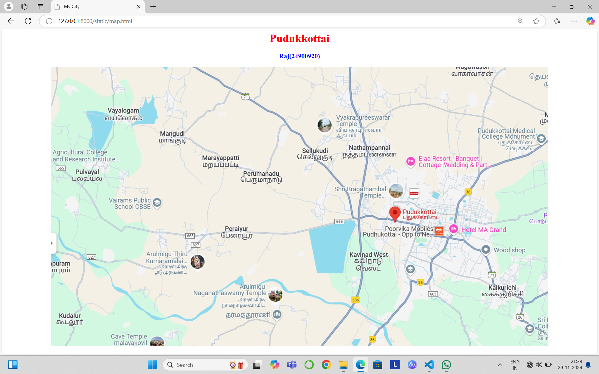
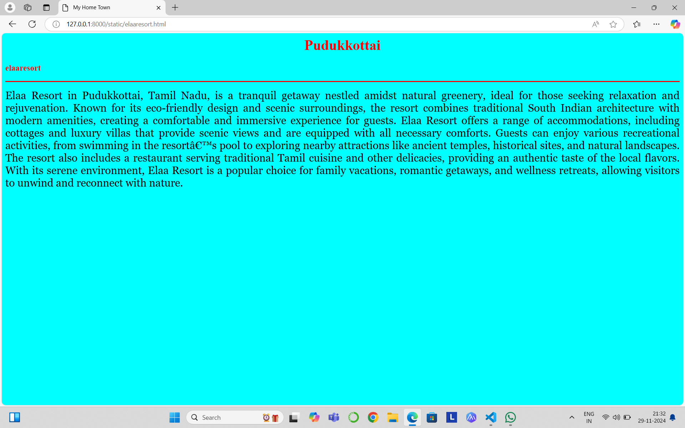
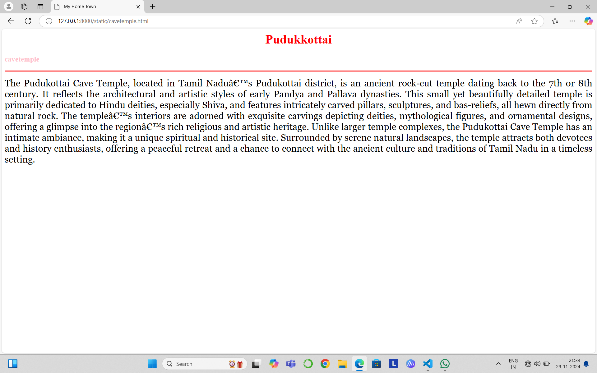
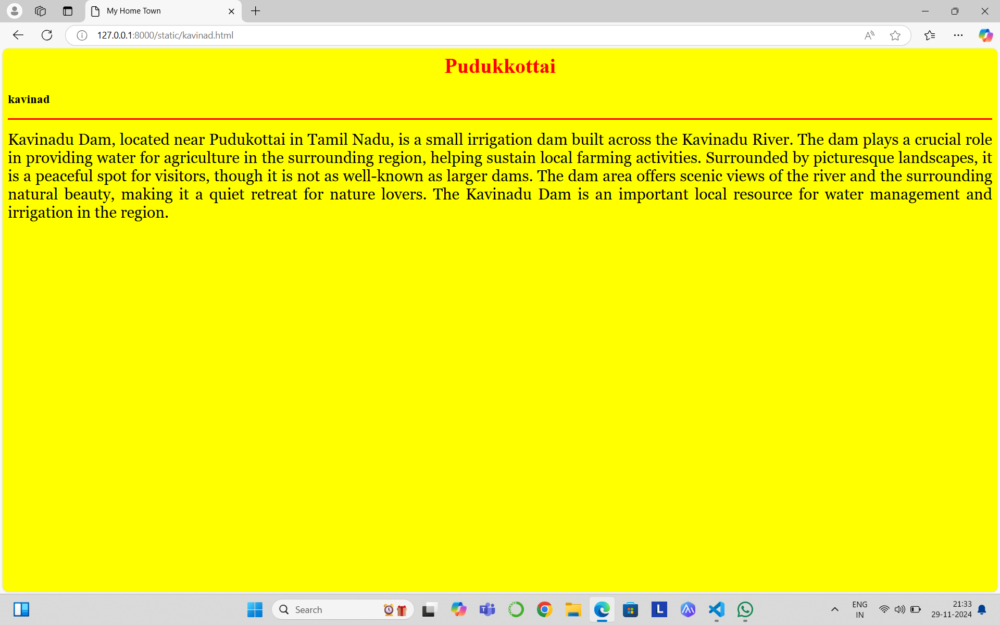
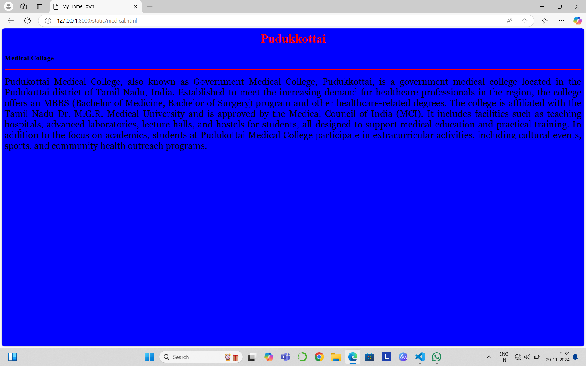
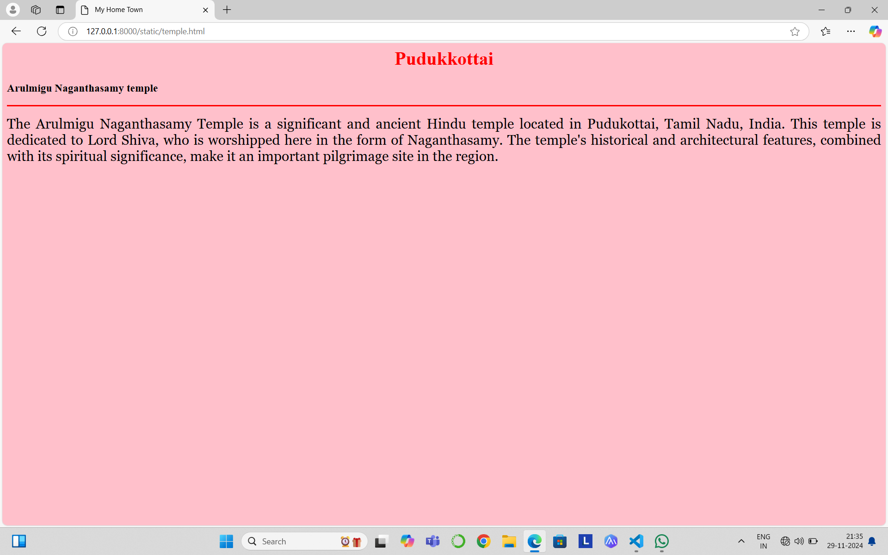

# Ex04 Places Around Me
## Date:29.11.2024

## AIM
To develop a website to display details about the places around my house.

## DESIGN STEPS

### STEP 1
Create a Django admin interface.

### STEP 2
Download your city map from Google.

### STEP 3
Using ```<map>``` tag name the map.

### STEP 4
Create clickable regions in the image using ```<area>``` tag.

### STEP 5
Write HTML programs for all the regions identified.

### STEP 6
Execute the programs and publish them.

## CODE

```

map.html

<html>
<head>
<title> My City</title>
</head>
<body>
<h1 align="center">
<font color="red"><b>Pudukkottai</b></font>   
</h1>
<h3 align="center">
<font color="blue"><b>Raj(24900920)</b></font>
</h3>
<center>
    
<map name="image-map">
    <area target="" alt="kavinad.html" title="kavinad.html" href="" coords="839,518,965,593" shape="rect">
    <area target="" alt="cavetemple.html" title="cavetemple.html" href="" coords="266,770,73" shape="circle">
    <area target="" alt="elaaresort.html" title="elaaresort.html" href="" coords="990,248,1147,320" shape="rect">
    <area target="" alt="temple.html" title="temple.html" href="" coords="608,678,70" shape="circle">
    <area target="" alt="medical.html" title="medical.html" href="" coords="1252,172,1383,243" shape="rect">
</map>
</map> 
</center>
</body>
</html>


elaaresort.html

<html>
<head>
<title>My Home Town</title>
</head>
<body bgcolor="cyan">
    <h1 align="center">
    <font color="red"><b>Pudukkottai</b></font>
    </h1>
    <h3 align=""center">
        <font color="red"><b>elaaresort</b></font>
    </h3>
    <hr size="3" color="red">
    <p align="justify">
    <font face="Georgia" size="5" color="black">
        Elaa Resort in Pudukkottai, Tamil Nadu, is a tranquil getaway nestled amidst natural greenery, ideal for those seeking relaxation and rejuvenation. Known for its eco-friendly design and scenic surroundings, the resort combines traditional South Indian architecture with modern amenities, creating a comfortable and immersive experience for guests.
Elaa Resort offers a range of accommodations, including cottages and luxury villas that provide scenic views and are equipped with all necessary comforts. Guests can enjoy various recreational activities, from swimming in the resort’s pool to exploring nearby attractions like ancient temples, historical sites, and natural landscapes.
The resort also includes a restaurant serving traditional Tamil cuisine and other delicacies, providing an authentic taste of the local flavors. With its serene environment, Elaa Resort is a popular choice for family vacations, romantic getaways, and wellness retreats, allowing visitors to unwind and reconnect with nature.
    </font>
    </p>
</body>
</html>


cave.html

<html>
<head>
<title>My Home Town</title>
</head>
<body bgcolor="white">
    <h1 align="center">
    <font color="red"><b>Pudukkottai</b></font>
    </h1>
    <h3 align=""center">
        <font color="pink"><b>cavetemple</b></font>
    </h3>
    <hr size="3" color="red">
    <p align="justify">
    <font face="Georgia" size="5" color="black">
        The Pudukottai Cave Temple, located in Tamil Nadu’s Pudukottai district, is an ancient rock-cut temple dating back to the 7th or 8th century. It reflects the architectural and artistic styles of early Pandya and Pallava dynasties. This small yet beautifully detailed temple is primarily dedicated to Hindu deities, especially Shiva, and features intricately carved pillars, sculptures, and bas-reliefs, all hewn directly from natural rock.
The temple’s interiors are adorned with exquisite carvings depicting deities, mythological figures, and ornamental designs, offering a glimpse into the region’s rich religious and artistic heritage. Unlike larger temple complexes, the Pudukottai Cave Temple has an intimate ambiance, making it a unique spiritual and historical site.
Surrounded by serene natural landscapes, the temple attracts both devotees and history enthusiasts, offering a peaceful retreat and a chance to connect with the ancient culture and traditions of Tamil Nadu in a timeless setting.
    </font>
    </p>
</body>
</html>


kavinad.html

<html>
<head>
<title>My Home Town</title>
</head>
<body bgcolor="yellow">
    <h1 align="center">
    <font color="red"><b>Pudukkottai</b></font>
    </h1>
    <h3 align=""center">
        <font color="black"><b>kavinad</b></font>
    </h3>
    <hr size="3" color="red">
    <p align="justify">
    <font face="Georgia" size="5" color="black">
        Kavinadu Dam, located near Pudukottai in Tamil Nadu, is a small irrigation dam built across the Kavinadu River. The dam plays a crucial role in providing water for agriculture in the surrounding region, helping sustain local farming activities. Surrounded by picturesque landscapes, it is a peaceful spot for visitors, though it is not as well-known as larger dams. The dam area offers scenic views of the river and the surrounding natural beauty, making it a quiet retreat for nature lovers. The Kavinadu Dam is an important local resource for water management and irrigation in the region.
     

   </font>
    </p>
</body>
</html>


medical.html

<html>
<head>
<title>My Home Town</title>
</head>
<body bgcolor="blue">
    <h1 align="center">
    <font color="red"><b>Pudukkottai</b></font>
    </h1>
    <h3 align=""center">
        <font color="black"><b>Medical Collage</b></font>
    </h3>
    <hr size="3" color="red">
    <p align="justify">
    <font face="Georgia" size="5" color="black">
        Pudukottai Medical College, also known as Government Medical College, Pudukkottai, is a government medical college located in the Pudukottai district of Tamil Nadu, India. Established to meet the increasing demand for healthcare professionals in the region, the college offers an MBBS (Bachelor of Medicine, Bachelor of Surgery) program and other healthcare-related degrees. 
The college is affiliated with the Tamil Nadu Dr. M.G.R. Medical University and is approved by the Medical Council of India (MCI). It includes facilities such as teaching hospitals, advanced laboratories, lecture halls, and hostels for students, all designed to support medical education and practical training. 
In addition to the focus on academics, students at Pudukottai Medical College participate in extracurricular activities, including cultural events, sports, and community health outreach programs.
    </font>
    </p>
</body>
</html>


temple.html

<html>
<head>
<title>My Home Town</title>
</head>
<body bgcolor="pink">
    <h1 align="center">
    <font color="red"><b>Pudukkottai</b></font>
    </h1>
    <h3 align=""center">
        <font color="black"><b>Arulmigu Naganthasamy temple</b></font>
    </h3>
    <hr size="3" color="red">
    <p align="justify">
    <font face="Georgia" size="5" color="black">
        The Arulmigu Naganthasamy Temple is a significant and ancient Hindu temple located in Pudukottai, Tamil Nadu, India. This temple is dedicated to Lord Shiva, who is worshipped here in the form of Naganthasamy. The temple's historical and architectural features, combined with its spiritual significance, make it an important pilgrimage site in the region.
    </p>
</body>
</html>

```

## OUTPUT









## RESULT
The program for implementing image maps using HTML is executed successfully.
